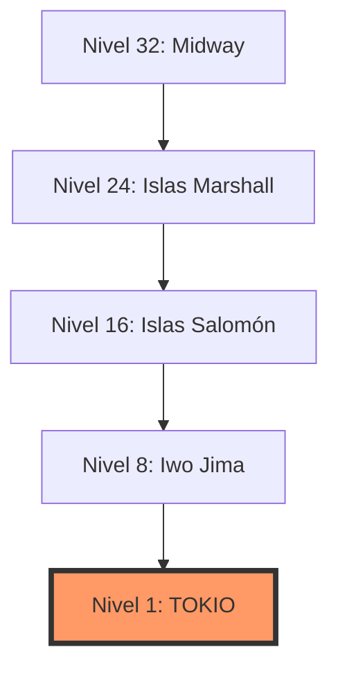
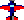
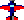
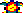

# 🛩️ 1942: El Clásico de Capcom

Bienvenidos al resumen definitivo de **1942**, el juego que definió los cimientos de los shooters de scroll vertical. Lanzado por Capcom en 1984, este título nos transporta a las batallas aéreas más intensas del Pacífico. 

---

## 📊 Ficha Técnica

| Categoría | Detalle |
| :--- | :--- |
| **Desarrollador** | Capcom |
| **Diseñador** | Yoshiki Okamoto |
| **Lanzamiento** | 1984 |
| **Género** | Shoot 'em up (V-Scrolling) |
| **Niveles** | 32 Etapas |
| **Protagonista** | Lockheed P-38 Lightning |

---

## 🎮 Controles y Comandos ("Lo que mandan")

Si te preguntas qué se necesita para pilotar esta leyenda, aquí tienes los comandos básicos del gabinete original:

*   **Palanca (Joystick)**: Controla el movimiento en 8 direcciones por toda la pantalla.
*   **Botón 1 (Fuego)**: Disparo estándar. ¡Mantén el ritmo para no ser derribado!
*   **Botón 2 (Rizo/Loop)**: Realiza un giro de 360° en el aire. Te vuelve **invulnerable** temporalmente. Úsalo con sabiduría, ¡es limitado!

---

## 🚀 Mecánicas Principales

### 🔴 Los Aviones Rojos y el "POW"
Cuando eliminas una formación completa de aviones enemigos rojos, aparecerá un ícono de **POW**. Capturarlo es clave para tu supervivencia:

1.  **Escoltas**: Dos mini-aviones que vuelan a tus lados, duplicando tu potencia de fuego.
2.  **Munición Triple**: Mejora tu disparo simple a uno más ancho.
3.  **Destrucción Total**: Limpia todos los enemigos en pantalla instantáneamente.

### 🗺️ El Camino a Tokio
El juego utiliza un sistema de niveles regresivo, comenzando en el nivel 32 (Midway) y terminando en el nivel 1 (Tokio).

```mermaid
graph TD
    A[Nivel 32: Midway] --> B[Nivel 24: Islas Marshall]
    B --> C[Nivel 16: Islas Salomón]
    C --> D[Nivel 8: Iwo Jima]
    D --> E[Nivel 1: TOKIO]
    style E fill:#f96,stroke:#333,stroke-width:4px
```

---

## 🌟 Curiosidades y Legado

> [!IMPORTANT]
> **1942** fue el primer juego de Capcom en ser portado a una consola casera (la NES), lo que ayudó a cimentar la fama mundial de la compañía.

*   **Puntuación por Derribos**: Al final de cada nivel, se te evalúa con un porcentaje. Si no alcanzas un mínimo, ¡perderás jugosas bonificaciones!
*   **Música de Marcha**: La banda sonora utiliza un efecto de "tam-tam" militar que es reconocido instantáneamente por cualquier veterano de los arcades.

---

## 🖼️ Galería de Sprites

A continuación se muestran los sprites y assets disponibles para el proyecto, extraídos de las hojas de referencia oficiales de *1942*.

### Avión del Jugador — Lockheed P-38 Lightning

| Frame 1 | Frame 2 | Frame 3 | Frame 4 |
|:-------:|:-------:|:-------:|:-------:|
|  Avión centro |  Avión centro 2 |  Avión centro 3 |  Avión centro 4 |

| Inclinado izquierda | Inclinado derecha | Rizo (loop) | Despegue / Aterrizaje |
|:-------------------:|:-----------------:|:-----------:|:---------------------:|
|  Izquierda |  Derecha |  Roll |  Despegue |

| Explosión del jugador |
|:---------------------:|
|  Explosión |

### Escolta y Proyectiles

| Avión escolta | Bala del jugador |
|:-------------:|:----------------:|
|  Escolta |  Bala |

### Enemigos

| Tipo 1 | Tipo 2 | Tipo 3 | Tipo 4 |
|:------:|:------:|:------:|:------:|
|  Enemigo 1 |  Enemigo 2 |  Enemigo 3 |  Enemigo 4 |

| Kurogane Kai | Akotzu | Bud | Shoryu |
|:------------:|:------:|:---:|:------:|
|  Kurogane Kai |  Akotzu |  Bud |  Shoryu |

| Raizan | Fukusuke / Yosuke | Qing | Daihiryu |
|:------:|:-----------------:|:----:|:--------:|
|  Raizan |  Fukusuke |  Qing |  Daihiryu |

### Jefes y Power-ups

| Jefe Ayako | Explosión enemiga | Power-up POW |
|:----------:|:-----------------:|:------------:|
|  Ayako |  Explosión enemiga |  POW |

---

> [!TIP]
> No uses el "Rizo" (Loop) contra los jefes grandes (como el bombardero Ayako) a menos que sea estrictamente necesario para esquivar una bala, ya que es mejor posicionarse bien para seguir disparando.
