# 🛩️ 1942: El Clásico de Capcom

Bienvenidos al resumen definitivo de **1942**, el juego que definió los cimientos de los shooters de scroll vertical. Lanzado por Capcom en 1984, este título nos transporta a las batallas aéreas más intensas del Pacífico durante la Segunda Guerra Mundial.

---

## 📊 Ficha Técnica

| Categoría | Detalle |
| :--- | :--- |
| **Desarrollador** | Capcom |
| **Diseñador** | Yoshiki Okamoto |
| **Lanzamiento** | 1984 |
| **Género** | Shoot 'em up (V-Scrolling) |
| **Niveles** | 32 Etapas |
| **Protagonista** | Lockheed P-38 Lightning |
| **Plataformas destacadas** | Arcade, NES, MSX, Game Boy Color |

---

## 🖼️ Galería de Sprites y Assets

A continuación se muestran los sprites y assets disponibles para el proyecto, extraídos de las hojas de referencia oficiales de *1942*.

### Avión del Jugador — Lockheed P-38 Lightning

| Frame 1 | Frame 2 | Frame 3 | Frame 4 |
|:-------:|:-------:|:-------:|:-------:|
|  | [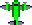](sprites/player_plane_2.png) | [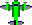](sprites/player_plane_3.png) |  |

| Inclinado izquierda | Inclinado derecha | Rizo (loop) | Despegue / Aterrizaje |
|:-------------------:|:-----------------:|:-----------:|:---------------------:|
| [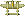](sprites/player_plane_left.png) | [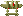](sprites/player_plane_right.png) | [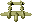](sprites/player_roll_1.png) | [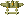](sprites/player_takeoff_1.png) |

| Explosión del jugador |
|:---------------------:|
| [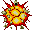](sprites/player_explosion_1.png) |

### Escolta y Proyectiles

| Avión escolta | Bala del jugador |
|:-------------:|:----------------:|
| [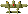](sprites/player_escort_flying.png) |  |

### Enemigos Comunes

| Tipo 1 | Tipo 2 | Tipo 3 | Tipo 4 |
|:------:|:------:|:------:|:------:|
| [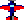](sprites/enemy_plane_1.png) |  |  | [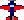](sprites/enemy_plane_4.png) |

### Enemigos de Mayor Tamaño

| Kurogane Kai | Akotzu | Bud | Shoryu |
|:------------:|:------:|:---:|:------:|
|  |  |  | [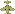](sprites/enemy_shoryu.png) |

| Raizan | Fukusuke / Yosuke | Qing | Daihiryu |
|:------:|:-----------------:|:----:|:--------:|
|  |  | [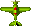](sprites/enemy_qing.png) | [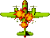](sprites/enemy_daihiryu.png) |

### Jefes, Explosiones y Power-ups

| Jefe Ayako | Explosión enemiga | Power-up POW |
|:----------:|:-----------------:|:------------:|
| [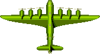](sprites/boss_ayako.png) |  |  |

| Explosión enemiga 2 | Explosión enemiga 3 | Explosión enemiga 4 |
|:-------------------:|:-------------------:|:-------------------:|
| [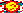](sprites/explosion_enemy_2.png) |  | [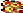](sprites/explosion_enemy_4.png) |

---

## 📝 Descripción del Juego

**1942** es un *shoot 'em up* de desplazamiento vertical en el que el jugador controla un caza Lockheed P-38 Lightning sobre el océano Pacífico. El objetivo es sobrevivir a 32 etapas de combate aéreo intenso, derribando escuadrones enemigos, esquivando proyectiles y enfrentándose a enormes bombarderos jefe antes de llegar a Tokio.

Cada nivel representa una región del Pacífico, y la dificultad aumenta progresivamente con formaciones más complejas, enemigos más resistentes y un mayor número de proyectiles en pantalla. El juego se distingue por su sistema de "rizo" o *loop*, que permite al jugador esquivar ataques volviéndose momentáneamente invulnerable.

---

## 📖 Historia

Año **1942**. La guerra se extiende por el Pacífico y Estados Unidos lanza una arriesgada misión aérea para revertir el curso del conflicto. Tú eres el piloto de un **Lockheed P-38 Lightning**, uno de los cazas más versátiles de la época.

Tu objetivo: despegar desde el portaaviones cerca de **Midway**, atravesar las defensas japonesas en las Islas Marshall, sobrevivir al infierno de las Islas Salomón, superar la resistencia de **Iwo Jima** y finalmente alcanzar **Tokio** para llevar a cabo una incursión decisiva.

A lo largo del camino te enfrentarás a escuadrones de cazas, bombarderos, naves especiales y al temible bombardero jefe **Ayako**. Con suerte, recogerás íconos **POW** que enviarán escoltas a tu lado o potenciarán tus disparos. Cada vida perdida representa otro avión caído en el Pacífico, y cada etapa completada acerca un poco más la victoria.

---

## 🎮 Mecánicas del Juego

### Controles

Si te preguntas qué se necesita para pilotar esta leyenda, aquí tienes los comandos básicos del gabinete original:

* **Palanca (Joystick)**: Controla el movimiento en 8 direcciones por toda la pantalla.
* **Botón 1 (Fuego)**: Disparo estándar. ¡Mantén el ritmo para no ser derribado!
* **Botón 2 (Rizo/Loop)**: Realiza un giro de 360° en el aire. Te vuelve **invulnerable** temporalmente. Úsalo con sabiduría, ¡es limitado!

### Obstáculos y Enemigos

Durante las 32 etapas el jugador se enfrenta a diversos peligros:

* **Aviones enemigos comunes**: Patrullan en formaciones predecibles y disparan proyectiles simples.
* **Formaciones rojas**: Destruir una formación completa de aviones rojos hace aparecer un **POW**.
* **Enemigos grandes**: Naves como **Kurogane Kai**, **Akotzu**, **Bud**, **Shoryu**, **Raizan**, **Fukusuke**, **Qing** y **Daihiryu** tienen más resistencia y suelen ocupar más espacio en pantalla.
* **Jefe Ayako**: Un bombardero gigante que aparece al final de etapas clave y requiere concentrar el fuego durante varios segundos.
* **Explosiones**: Tanto el jugador como los enemigos disponen de animaciones de destrucción.

### Sistema de POW y Escoltas

Cuando eliminas una formación completa de aviones enemigos rojos, aparecerá un ícono de **POW**. Capturarlo es clave para tu supervivencia:

1. **Escoltas**: Dos mini-aviones que vuelan a tus lados, duplicando tu potencia de fuego.
2. **Munición Triple**: Mejora tu disparo simple a uno más ancho.
3. **Destrucción Total**: Limpia todos los enemigos en pantalla instantáneamente.

> [!TIP]
> No uses el "Rizo" (Loop) contra los jefes grandes (como el bombardero Ayako) a menos que sea estrictamente necesario para esquivar una bala, ya que es mejor posicionarse bien para seguir disparando.

### Puntuación y Progresión

El sistema de puntuación de **1942** recompensa la precisión y la supervivencia:

* **Puntos por derribo**: Cada avión enemigo otorga una cantidad fija de puntos; las naves grandes y los jefes otorgan más.
* **Bonificación por etapa**: Al final de cada nivel se evalúa el porcentaje de derribos. Si no alcanzas el mínimo requerido, perderás jugosas bonificaciones.
* **Vidas extra**: Se obtienen al alcanzar ciertos umbrales de puntuación.
* **Camino a Tokio**: El juego utiliza un sistema de niveles regresivo, comenzando en el nivel 32 (Midway) y terminando en el nivel 1 (Tokio).

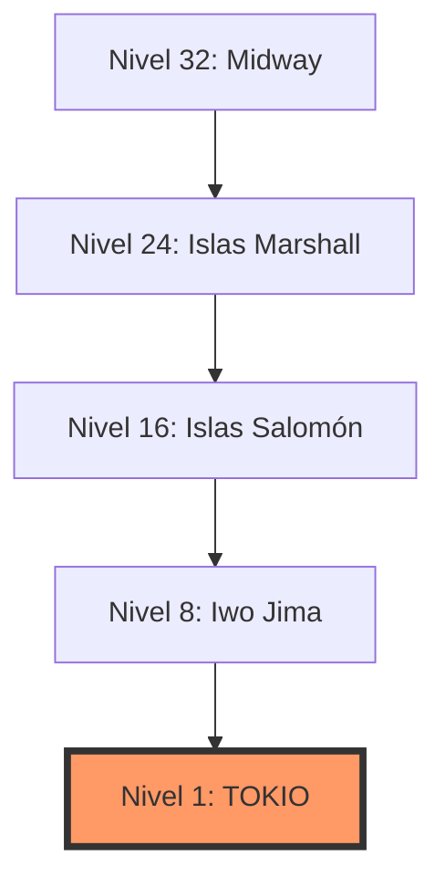
```mermaid
graph TD
    A[Nivel 32: Midway] --> B[Nivel 24: Islas Marshall]
    B --> C[Nivel 16: Islas Salomón]
    C --> D[Nivel 8: Iwo Jima]
    D --> E[Nivel 1: TOKIO]
    style E fill:#f96,stroke:#333,stroke-width:4px
```

---

## 🗺️ Las 32 Etapas del Pacífico

El recorrido completo de **1942** atraviesa 32 etapas distribuidas por escenarios icónicos del Pacífico. A continuación se resumen las etapas más representativas:

| Rango de niveles | Ubicación | Descripción |
| :--------------- | :-------- | :---------- |
| 32 - 25 | Midway y sector inicial | Entrenamiento básico, formaciones simples y primeros bombarderos. |
| 24 - 17 | Islas Marshall | Mayor densidad de enemigos y aparición de naves medianas. |
| 16 - 9 | Islas Salomón | Escenarios densos con formaciones rojas frecuentes y más proyectiles. |
| 8 - 2 | Iwo Jima | Dificultad máxima antes del final; enemigos agresivos y jefes repetidos. |
| 1 | Tokio | Etapa final: derrota al jefe principal para completar la misión. |

Cada grupo de etapas introduce nuevos patrones de ataque y mayores recompensas, forzando al jugador a dominar tanto el disparo como el uso estratégico del rizo.

---

## 🧩 Sprites

La siguiente tabla resume todos los sprites disponibles en el proyecto, su descripción y la cantidad de frames de animación inferidos a partir de los nombres de archivo.

| Sprite | Descripción | Frames |
| :----- | :---------- | :----: |
|  | Avión del jugador — Frame 1 | 4 |
|  | Avión del jugador — Frame 2 | 4 |
|  | Avión del jugador — Frame 3 | 4 |
|  | Avión del jugador — Frame 4 | 4 |
|  | Avión del jugador inclinado a la izquierda | 1 |
|  | Avión del jugador inclinado a la derecha | 1 |
|  | Animación de rizo (loop) del jugador | 1 |
|  | Frame de despegue o aterrizaje | 1 |
|  | Explosión del jugador al perder una vida | 1 |
|  | Escolta que acompaña al jugador tras capturar POW | 1 |
|  | Proyectil disparado por el jugador | 1 |
|  | Avión enemigo común — Frame 1 | 4 |
|  | Avión enemigo común — Frame 2 | 4 |
|  | Avión enemigo común — Frame 3 | 4 |
|  | Avión enemigo común — Frame 4 | 4 |
|  | Enemigo Kurogane Kai | 1 |
|  | Enemigo Akotzu | 1 |
|  | Enemigo Bud | 1 |
|  | Enemigo Shoryu | 1 |
|  | Enemigo Raizan | 1 |
|  | Enemigo Fukusuke / Yosuke | 1 |
|  | Enemigo Qing | 1 |
|  | Enemigo Daihiryu | 1 |
|  | Jefe bombardero Ayako | 1 |
|  | Explosión de enemigo — Frame 1 | 4 |
|  | Explosión de enemigo — Frame 2 | 4 |
|  | Explosión de enemigo — Frame 3 | 4 |
|  | Explosión de enemigo — Frame 4 | 4 |
|  | Ícono de power-up POW | 1 |

---

## 🌟 Características Visuales

* **Scroll vertical clásico**: El fondo azul del océano Pacífico avanza constantemente mientras los enemigos aparecen desde arriba.
* **Paleta arcade limitada**: Colores brillantes y contrastados típicos de los salones recreativos de principios de los 80.
* **Sprites detallados**: Aviones con múltiples frames de animación, inclinaciones laterales y efectos de destrucción.
* **Feedback inmediato**: Explosiones visibles tanto para el jugador como para los enemigos, y power-ups claramente diferenciados.
* **Estética militar**: Marchas y efectos de sonido evocan la época bélica del Pacífico.

---

## 🏆 Curiosidades y Legado

> [!IMPORTANT]
> **1942** fue el primer juego de Capcom en ser portado a una consola casera (la NES), lo que ayudó a cimentar la fama mundial de la compañía.

* **Música de marcha**: La banda sonora utiliza un efecto de "tam-tam" militar reconocido al instante por cualquier veterano de los arcades.
* **Inspiración histórica**: Aunque simplificado, el juego se inspira en la campaña estadounidense del Pacífico durante 1942.
* **Secuelas**: El éxito de 1942 dio origen a **1943: The Battle of Midway** y otros títulos de la saga.
